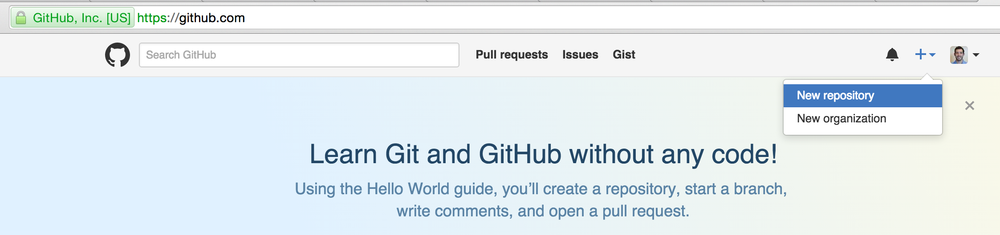
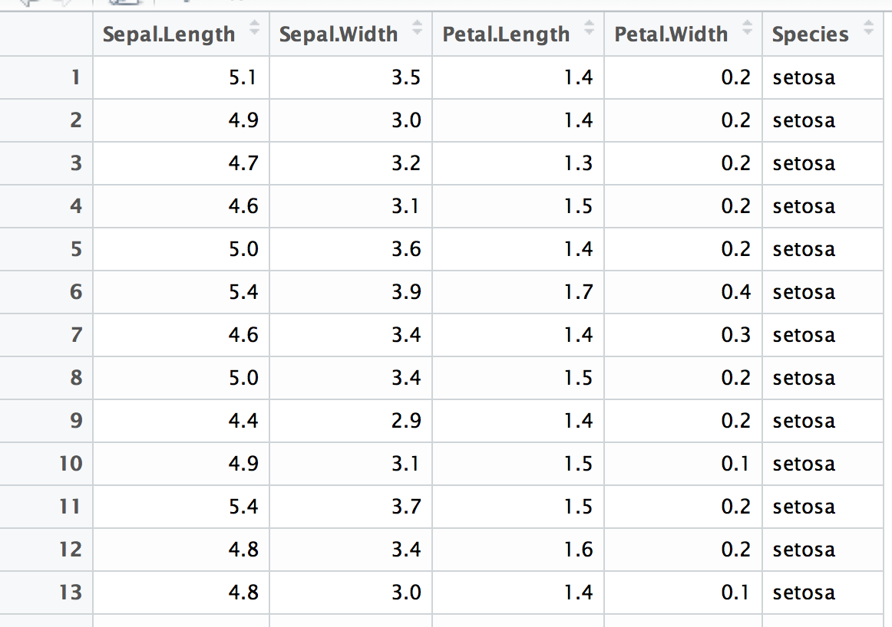

Building Applications
=====================

RStudio's shiny framework provides a straightforward structure for creating not just *websites*, but web *applications*. By providing R users with the ability to generate web-based interfaces that communicate with R servers, shiny enables developers to create dynamic platforms for data exploration.

The purpose of this assignment is to provide you with the opportunity to practice building a shiny application. Once you are comfortable with the general skeleton of these applications, transforming your analyses into interactive experiences will be nearly painless.

Assignment structure
--------------------

For this assignment, you will create a repository in which you build your own shiny application. The application should provide users with the ability to interact with a visual representation of the `iris` dataset (more info below). What the application looks like is up to you, as long as it meets the following requirements:

-   There is a `sidePanel` in which you've created **at least two widgets** that change the visual output in your application
-   One of your widgets must **change the data that is being displayed**. For example, the attribute being shown on the x or y axis. Simply changing the color of the markers *would not* meet this requirement.
-   You must create a visual representation of a dataset that reacts to the widgets in the `sidePanel`
-   You must push your application up to the `shinyapps.io` server, making it publically usable

As you know, in order to run a shiny application, you must create multiple files:

-   A `ui.R` file, that drives the structure of the user interface
-   A `server.R` file, that provides instructions to the R server
-   A `Readme.md` file, because it's important to document your code. This file should contain a link to your project.

The purpose of this project really is just to make sure you're comfortable with the structure of a web application. Feel free to be creative in your assignment, though a scatter-plot with 2 widgets controlling the x variable and y variable would be sufficient.

Expectations
------------

At this point in the quarter, we expect you to be following the *best practices* we've incorporated into the class. This means:

-   Proper use of libraries such as `dplyr` for data wrangling
-   Structuring your code so that if the data changes, you can easily update your **entire** application
-   Clearly commenting and properly organizing your code
-   Writing functions to encapsulate chunks of code that you use more than once
-   Avoiding the creating of variables that are unnecessary for your analysis/report
-   Creating appropriate labels for your visualizations

Resources
---------

The following resources may be helpful for getting started with your project. As always, google and stackoverflow will likely be needed to supplement this information when you run into specific problems:

-   Shiny [documentation](http://shiny.rstudio.com/reference/shiny/latest/)
-   Shiny [tutorial](http://shiny.rstudio.com/tutorial/)
-   Shiny [widgets](http://shiny.rstudio.com/gallery/widget-gallery.html)
-   Shinyapps.io [hosting site](https://www.shinyapps.io/)
-   Plotly + shiny [examples](https://plot.ly/r/shiny-tutorial/)

Set-up
------

As in assignment 7, in this assignment, you'll initialize your own repository (**do not** fork this one). You can easily create a repository through the GitHub interface:

Once you've created your repository, you should create the necessary files (`ui.R`, `server.R`, and `Readme.md` to begin your project).

Iris Dataset
------------

For this assignment, you'll be using the `iris` dataset, a simple dataset that is built into R. This dataset is often used to demonstrate the challenges of classification in statistics and visualization. Each of the 150 rows of this data is an observation of a flower, and the columns express different physical qualities of the flowers:

Building the application
------------------------

As stated above, you've required to create at least two components of your application:

### sidePanel

In your `sidePanel`, you should create two widgets of your choice. As stated above in the requirements, at least one of these widgets should change the data being displayed. This may require you to interpret a string as a variable name, which [isn't too hard](http://www.r-bloggers.com/converting-a-string-to-a-variable-name-on-the-fly-and-vice-versa-in-r/). Feel free to use whichever types of widgets you want, as long as they update the visual representation of the data.

### Visual representation

The `mainPanel` of your application should contain a visual representation of the `iris` dataset. The visualization can be made with base R graphics, [plotly](https://plot.ly/r/), or something less supported but [more interesting](https://github.com/juba/scatterD3). While we don't expect you to create anything ground-breaking, we do expect you to create a clear visualization with proper labels. And of course, the graphic needs to react to changing values in the widgets.

Submission
----------

Before submitting your assignment, please create a `Readme.md` file **in your repository** that **contains a link** to your shinyapps.io project. Also, please answer the following questions (submit the URL of your repo as your assignment):

##### 1. Did you receive any help from others (classmates, etc)? If so, please list who.

> Answer goes here!

##### 2. Approximately how many hours did it take you to complete this challenge?

> Answer goes here!

##### 3. On a scale of 1 (too easy) to 10 (too challenging), how difficult was this challenge?

> Answer goes here!

##### 4. Did you encounter any problems in this challenge we should warn students about in the future? How can we make the challenge better?

> Answer goes here!

Please submit this GitHub repository to <a href="https://canvas.uw.edu/courses/1023398/assignments/3079013" target="_blank">Canvas</a> as your assignment, and thanks for your hard work!
